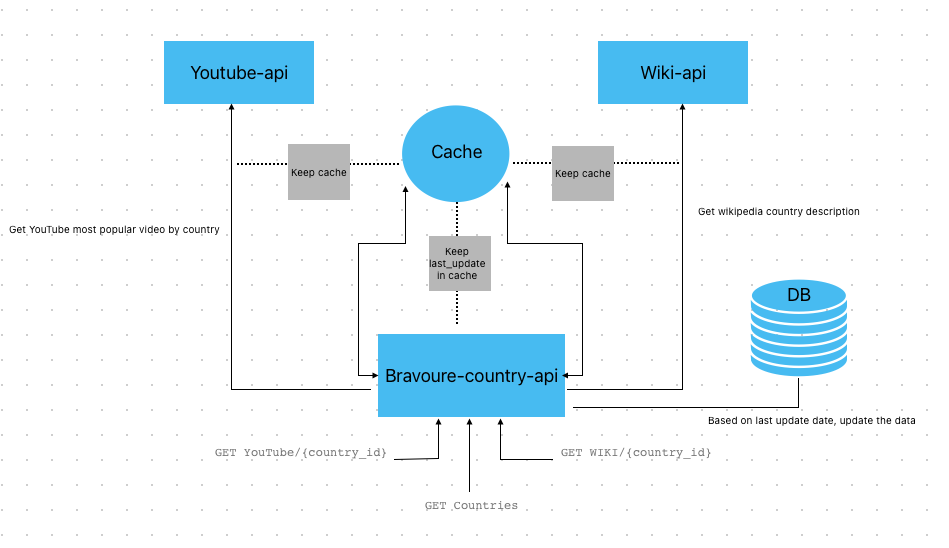

# Bravoure Country API

Welcome to the Bravoure Country API documentation! This API provides endpoints to fetch YouTube video data, Wikipedia text, and a list of countries
## Table of Contents

- [Introduction](#introduction)
- [Features](#features)
- [system architecture](#System-architecture)
- [Installation](#installation)
- [Usage](#usage)
- [API Endpoints](#api-endpoints)
- [Contributing](#contributing)
- [License](#license)

## Introduction

The Bravoure Country API is a Laravel-powered API that allows users to retrieve YouTube video data, Wikipedia text, and a list of countries. The API is designed to be user-friendly and provides various endpoints for accessing different types of data.

## Features

- Fetch YouTube video data for a specific country.
- Retrieve Wikipedia text for a given country.
- Get a list of all countries.

## System Architecture



## Installation

To set up the Bravoure Country API using Laravel Sail:

1. Clone the repository:

   ```bash
   git clone git@github.com:boughanmiyasmin/bravoure-country-api.git
   cd bravoure-country-api

2. Install Composer dependencies
   ```bash
   composer install
   
3. Create a copy of the .env.example file:
   ```bash
   cp .env.example .env

4. Get docker containers running:
   ```bash
   ./vendor/bin/sail up -d

5. Configure your .env file with necessary database and application settings.
   don't forget to add the YOUTUBE_API_KEY

6. Run migration:
   ```bash
   ./vendor/bin/sail artisan migrate
## Usage

The API provides three main endpoints for fetching data. Here's how to use them:

- YouTube Video Data Endpoint: Fetch the most popular YouTube video data for a specific country.

  `GET /api/countries/youtube/{country_id}`

- Wikipedia Text Endpoint: Retrieve Wikipedia country description for a given country.

  `GET /api/countries/wikipedia/{country_id}`

- All Countries Endpoint: Get a list of all country's information.

  `GET /api/countries`

## API Endpoints

For detailed information about the API endpoints, request parameters, and response formats, please refer to the API Documentation (/api/documentation) file.

## License

This project is licensed under the MIT License (LICENSE).
